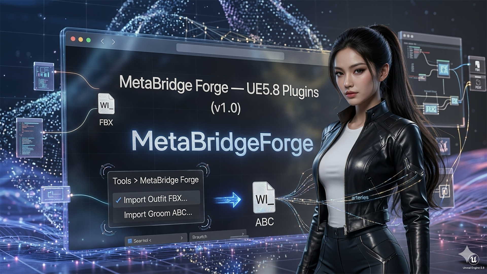

# MetaBridge Forge — User Guide (v1.1.1)



An editor plugin that automates MetaHuman outfit (clothing) and groom (hair) preparation. Aside from picking one FBX/Alembic file, everything from import through Wardrobe Item creation and verification happens automatically, with no manual steps in between.

**No project content setup required** — the template assets the pipelines are built on are bundled inside the plugin itself, so it works out of the box even in a brand-new project with an empty `Content/` folder. (You do need the MetaHuman Engine Component installed first — see Prerequisites below — that's a one-time Unreal Engine setup step, not something specific to this plugin.)

## Prerequisites (check this before installing)

This plugin depends on Epic's `MetaHumanCharacter` and `MetaHumanSDK` engine plugins. **These are not part of a default Unreal Engine 5.8 installation** — they only exist on disk if the optional **MetaHuman** Engine Component has been installed. If it hasn't, the editor will report missing/uninstalled MetaHuman components when this plugin is enabled.

**How to check/install it:**
1. Open the **Epic Games Launcher** → **Unreal Engine** tab → **Library**.
2. Find your UE 5.8 install, click the **gear/settings icon** on it → **Options**.
3. Make sure the **MetaHuman** component checkbox is checked. If it wasn't, check it and click **Apply** — this downloads and installs the component into that engine version (this is a one-time engine-level install, independent of any specific project).
4. Restart the editor once it finishes.

**If the install gets stuck in a "Queued" / "Resuming" loop that never finishes:** this is a known Epic Games Launcher download-manager issue, unrelated to this plugin. Things that commonly unstick it:
- Fully close the Epic Games Launcher (check Task Manager for a lingering `EpicGamesLauncher` process) and reopen it.
- Pause the download, wait a few seconds, then resume it.
- Confirm you have enough free disk space for the component.
- Run the Epic Games Launcher as Administrator.
- Temporarily disable antivirus/firewall software that may be blocking the download, then retry.
- As a last resort, use the engine's **Verify** option (same gear icon menu) to check for a corrupted install, or reinstall the Epic Games Launcher itself (this does not touch your projects or engine installs).

## Menu Location

Editor top menu: **Tools > MetaBridge Forge**

- **Import Outfit FBX...** — full outfit (clothing) pipeline
- **Import Groom ABC...** — full groom (hair) pipeline

Both menu items only show a file-picker dialog; everything else is automatic. A popup only appears on failure.

## Templates: Bundled, No Project Setup Needed

**This plugin doesn't generate content from scratch — it duplicates a template and retargets it.** In earlier versions (v1.0) the templates had to already exist in the project's own `Content/` folder; **since v1.1 that is no longer required.** The template assets (a working OA_/CA_ outfit set, and a groom's GroomMesh/Materials set) are **bundled inside the plugin's own content** under `/MetaBridgeForge/Templates/` (both fully self-contained — verified to have zero external `/Game/` dependencies, and verified end-to-end by running both pipelines cloning from the bundled copies), so in a fresh project the plugin works out of the box with no setup.

Template resolution order (automatic, per run):

1. **Project override first** — if the project has its own template at `/Game/Outfits/<OUTFIT_TEMPLATE_DEFAULT>/` (with a real OA_ inside) or at `GROOM_TEMPLATE_FOLDER`, that one is used.
2. **Plugin fallback** — otherwise the bundled copy under `/MetaBridgeForge/Templates/` is used. (Leftover redirectors from moving templates around do not count as a project override — the resolver checks for real assets.)

| Setting (`Content/Python/mbforge/config.py`) | Purpose |
|---|---|
| `OUTFIT_TEMPLATE_DEFAULT` | Name of the template outfit (default `"BasicOutfit"`) — used for both the project-override lookup and the plugin-bundled lookup |
| `GROOM_TEMPLATE_FOLDER` | Project-override path for the groom template (default `"/Game/Grooms/Beard_A/Beard_A"`) |
| `PLUGIN_GROOM_TEMPLATE_FOLDER` | Plugin-bundled groom template path — only change if you rebundle a different groom into the plugin |

To see the bundled templates in the Content Browser, enable **Settings > Show Plugin Content**.

If no template can be found in either location, nothing crashes — the run fails immediately with a "template not found" error in the log.

### How to edit config.py (optional — only for using your own project templates)

With the bundled templates, no config editing is required. Edit `Plugins/MetaBridgeForge/Content/Python/mbforge/config.py` only if you want a specific project template to take priority over the bundled one. Only the paths/names inside the quotes need to change.

```python
# 1) Outfit template name - if "/Game/Outfits/<this name>/" contains a real OA_, it wins over the bundled template
OUTFIT_TEMPLATE_DEFAULT = "BasicOutfit"        # → e.g. "MyTemplateOutfit"

# 2) Groom template folder - if this folder contains real assets, it wins over the bundled template
GROOM_TEMPLATE_FOLDER = "/Game/Grooms/Beard_A/Beard_A"   # → e.g. "/Game/Grooms/MyTemplateGroom/MyTemplateGroom"
```

Tip for finding the exact path: right-click the folder/asset in the Content Browser → **Copy Reference** to get the full, exact path.

You don't need to restart the editor after changing values — it may already be picked up the next time you click a menu item, but to be sure, reload it from the Python console:

```python
import importlib
from mbforge import config
importlib.reload(config)
```

## Import Outfit FBX...

1. Click the menu → pick the garment FBX file
2. What happens automatically:
   - Imports the garment as a Static Mesh + duplicates the template's reference body (`/Game/Outfits/<name>/<name>/Meshes/`)
   - Duplicates the template OA_/CA_ (+ their own Dataflow graphs) wholesale (`/Game/Outfits/<name>/`)
   - Retargets the duplicated CA_'s mesh references and the OA_'s `SizedOutfitSource` to point at the newly imported mesh
   - Creates `WI_<name>` Wardrobe Item + runs verification
3. The outfit name is auto-derived from the FBX filename (special characters replaced with `_`).
4. On success, only a log entry is written (Output Log) — no popup. On failure, an error popup appears with details in the Output Log.

## Import Groom ABC...

1. Click the menu → pick the hair Alembic (.abc) file
2. What happens automatically:
   - Clones the GroomMesh/Materials template files + imports the .abc as the groom asset (`/Game/Grooms/<name>/`)
   - Creates a binding (`GB_<name>`) onto the cloned reference head
   - Creates the `WI_<name>` Wardrobe Item
3. The groom name is auto-derived from the .abc filename.
4. On success, only a log entry is written — no popup. On failure, an error popup appears.

## Out of Automated Scope (manual work)

The following were deliberately left manual, since they need case-by-case judgment:

- Mesh retargeting for the compound case of an outfit with multiple CA_'s (call `duplicate_build.retarget_cloth_asset_meshes` / `retarget_outfit_source` directly from the Python console)
- Assigning a finished `WI_` to an actual MetaHuman character's slot (`character.internal_collection.try_add_item_from_wardrobe_item(slot_name=..., wardrobe_item=wi_asset)`)
- Groom hair color/material customization

## If Something Goes Wrong

1. Check the Output Log for lines starting with `MetaBridge Forge:` (**Window > Developer Tools > Output Log**)
2. Each pipeline function can be called directly from the Python console to re-run just one step, e.g.:
   ```python
   from mbforge import duplicate_build, groom, wardrobe
   duplicate_build.retarget_duplicated_outfit("MyOutfitName", garment_mesh, body_mesh)
   groom.finish_groom_setup("MyGroomName")
   wardrobe.finish_outfit_setup("MyOutfitName")
   ```

## Moving to Another Project/Computer

**Zipping up the plugin folder (`Plugins/MetaBridgeForge/`) is enough** — the template assets are bundled inside the plugin's `Content/Templates/` folder, so nothing else needs to be migrated. Checklist:

1. Copy the entire `Plugins/MetaBridgeForge/` folder into the target project's `Plugins/` folder.
   - If `Binaries/Win64/` is included, it works without a rebuild as long as the **engine version is exactly the same** (currently UE 5.8, same build as the Epic Games Launcher install).
   - `Intermediate/` and `Content/Python/**/__pycache__/` are build/runtime cache — no need to bring these along (safe to exclude from the zip).
   - If the engine version differs, `Source/` must be included, and the target machine will automatically trigger a one-time rebuild.
   - **Do include `Content/Templates/`** — that's the bundled template data the pipelines clone from.
2. Confirm the target machine's UE 5.8 install has the **MetaHuman Engine Component** installed (see Prerequisites above) and that the target project's `.uproject` has the `ChaosOutfitAsset` and `ChaosClothAsset` engine plugins set to `Enabled: true`.
3. (Optional) If the target project has its own, better-fitting template outfit/groom, point `config.py`'s `OUTFIT_TEMPLATE_DEFAULT` / `GROOM_TEMPLATE_FOLDER` at it — project templates always take priority over the bundled ones.

## Version

**v1.1.1** — Documented the MetaHuman Engine Component prerequisite (see Prerequisites above) after a user hit a confusing "MetaHuman components not installed" error plus an unrelated Epic Games Launcher stuck-download bug on a fresh engine install. No code changes.

**v1.1** — Template content (`BasicOutfit` outfit set, `Beard_A` groom set) moved into the plugin's own `Content/Templates/`, with project-first/plugin-fallback resolution — pre-existing base templates in the project are no longer required; the plugin works out of the box in a fresh project. Both pipelines verified end-to-end cloning from the bundled templates. Candidates for the next version: multi-CA_ support, automatic character-slot assignment, head accessories.

**v1.0** — Outfit/groom one-shot import pipelines complete. Unused dead code removed (`BODY_SKELETON_PATH`/`HEAD_SKELETON_PATH` in `config.py`, `confirm()` in `dialogs.py`).
